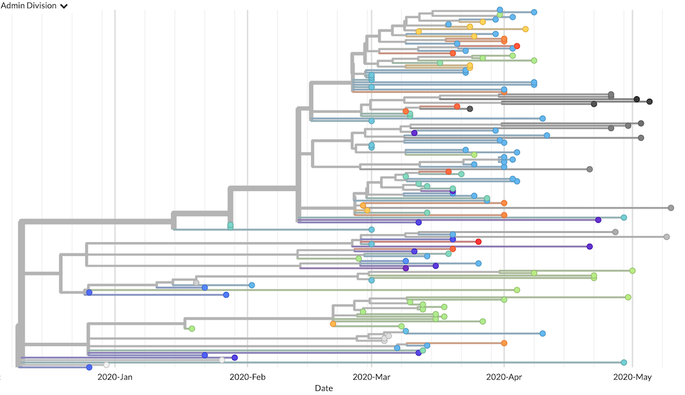

# Setup and installation
<!-- WARNING -->
<!-- Do not edit this file from within the docs.nextstrain.org repository. -->
<!-- It is fetched from another repository to be included in the docs.nextstrain.org build. -->
<!-- So, if you edit it after it is fetched into docs.nextstrain.org, your changes will be lost. -->
<!-- Instead, edit this file in its own repository and commit your changes there. -->
<!-- For more details on this (temporary) implementation, see https://github.com/nextstrain/docs.nextstrain.org#fetching-of-documents-from-other-repositories -->
<!-- This file is fetched from: https://github.com/nextstrain/ncov/blob/master/docs/setup.md -->
<!-- WARNING -->
<!-- WARNING -->
<!-- WARNING -->

The following steps will prepare you to run complete analyses of SARS-CoV-2 data by installing required software and running a simple example workflow.

## 1. Setup your Nextstrain environment with Conda

The following instructions use [Conda](https://docs.conda.io/en/latest/) to install the tools you'll need for this tutorial.
Conda is a package and environment management system that allows you to install Python and other software into controlled environments without disrupting other software you have installed (e.g., on your computer, your shared cluster, etc.).

<p style="color: #055160; background-color: #cff4fc; border-color: #b6effb; padding: 1em; border-radius: .25rem;">
If you use Microsoft Windows, [install the Windows Subsystem for Linux (WSL)](https://docs.microsoft.com/en-us/windows/wsl/install-win10).
Follow [instructions to open a new WSL window for your Linux distribution](https://docs.microsoft.com/en-us/windows/wsl/wsl-config) and then run the following commands.
</p>

### Create the Nextstrain environment

[Install Miniconda with Python 3 for your operating system](https://docs.conda.io/en/latest/miniconda.html), update Conda to the latest version, and install Mamba for faster installation.

```bash
conda update -n base conda
conda install -n base -c conda-forge mamba
```

Create a Conda environment named ``nextstrain``.
This command will install [Git](https://git-scm.com/), [Snakemake](https://snakemake.readthedocs.io/en/stable/), and [Nextstrain's full toolkit](https://docs.nextstrain.org/en/latest/install-nextstrain.html), the tools you'll need to work through this tutorial.

```bash
mamba create -n nextstrain -c conda-forge -c bioconda \
  augur auspice nextstrain-cli nextalign snakemake awscli git pip
```

Confirm that the installation worked.

```bash
conda activate nextstrain
nextstrain check-setup --set-default
```

The final output from the last command should look like this:

```bash
Setting default environment to native.
```

<p style="color: #212529; background-color: #ffc107; border-color: #b6effb; padding: 1em; border-radius: .25rem;">
If the final output from the last command is `Setting default environment to docker.`, close Docker and run the last command again.
The Nextstrain CLI will prefer the Docker environment when it is available, but this tutorial assumes you are running commands in the native environment.
</p>

### Update the Nextstrain environment

Update your environment regularly to the latest versions of these tools.

```bash
# Update Conda and Mamba.
conda update -n base conda mamba

# Update tools in the Nextstrain environment.
conda activate nextstrain
conda update --all
```

## 2. Download the ncov workflow

### Download the workflow

Use Git to download a copy of the ncov repository containing the workflow and this tutorial.

```bash
git clone https://github.com/nextstrain/ncov.git
cd ncov
```

Alternately, [download a compressed copy of the ncov repository](https://github.com/nextstrain/ncov/archive/refs/heads/master.zip) called `ncov-master.zip`.
Open this file to decompress it and create a directory called `ncov-master/` with the contents of the workflow in it.
Navigate to this directory from the command line.

### Update the workflow

We update the official workflow regularly with:

 - [curated metadata including latitudes/longitudes, clade annotations, and low quality sequences](https://github.com/nextstrain/ncov/commits/master)
 - bug fixes
 - [new features](https://github.com/nextstrain/ncov/blob/master/docs/change_log.md)

Update your local copy of the workflow, to benefit from these changes.

```bash
# Download and apply changes from the Nextstrain team.
# This only works if there is no conflict with your local repository.
git pull --ff-only origin master

# OR:

# Alternately, download and apply changes from the Nextstrain team
# and then replay your local changes on top of those incoming changes.
git pull --rebase origin master
```

Alternately, download a specific version of the workflow that you know works for you.
We create new [releases of the workflow](https://github.com/nextstrain/ncov/releases/) any time we introduce breaking changes, so you can choose when to update based on [what has changed](https://github.com/nextstrain/ncov/blob/master/docs/change_log.md).

```bash
# Download version 7 (v7) of the workflow.
curl -OL https://github.com/nextstrain/ncov/archive/refs/tags/v7.zip

# Uncompress the workflow.
unzip v7.zip

# Change into the workflow's directory.
cd ncov-7/
```

## 3. Run a basic analysis with example data

Run a basic workflow with example data, to confirm that your Nextstrain environment is properly configured.

```bash
nextstrain build . --cores 4 --use-conda \
  --configfile ./my_profiles/getting_started/builds.yaml
```

The `nextstrain build` command runs a pathogen analysis or "[build](https://docs.nextstrain.org/projects/augur/en/stable/faq/what-is-a-build.html)" defined by a Snakemake workflow in a specific directory.
Since our `Snakefile` is in the current directory, we specify the build directory as `.`.
All other arguments pass through to Snakemake.

The `--use-conda` flag [instructs Snakemake to maintain a workflow-specific Conda environment](https://snakemake.readthedocs.io/en/stable/snakefiles/deployment.html#integrated-package-management) defined in `workflow/envs/nextstrain.yaml`.
Snakemake will activate this environment before it runs each rule, ensuring each rule runs with the necessary software.
The first time you use this flag, Snakemake will download and install all Nextstrain tools required to run the workflow.
This can take a little time.
The next time you use this flag, Snakemake will detect the existing environment and use it immediately.

The `getting_started` build produces a minimal global phylogeny for visualization in Auspice.
This workflow should complete in about 10 minutes on a MacBook Pro (2.7 GHz Intel Core i5) with four cores, including 5 minutes to create the Conda environment and 5 minutes to run the workflow.

## 4. Visualize the phylogeny for example data

[Open http://auspice.us](http://auspice.us) in your browser.
Drag and drop the JSON file `auspice/ncov_global.json` anywhere on the [http://auspice.us](http://auspice.us) landing page, to visualize the resulting phylogeny.
The resulting phylogeny should look something like this.



## [Next Section: Preparing your data](data-prep.md)
